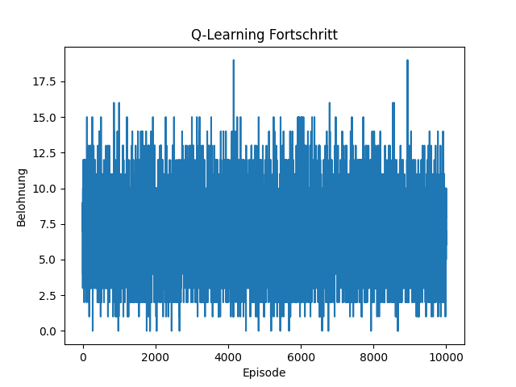

# KLearning - Q-Learning-Projekt

## Überblick
Dieses Projekt implementiert ein Q-Learning-Modell in C#. Es trainiert ein Modell basierend auf definierten Zuständen und Aktionen und speichert die Belohnungen pro Episode in einer JSON-Datei. Zusätzlich wird ein Python-Skript verwendet, um die Ergebnisse zu visualisieren.

## Komponenten

### `KLerning.cs`
Diese Datei enthält die Hauptlogik des Q-Learning-Modells. Es umfasst Funktionen zum Initialisieren des Q-Tables, zur Auswahl von Aktionen, zum Lernen und Aktualisieren der Q-Werte und zur Überprüfung der Konvergenz des Lernprozesses.

### `Program.cs`
Dies ist der Einstiegspunkt des Programms. Es erstellt eine Instanz von `KLerning`, führt das Training aus und speichert die Belohnungen pro Episode in einer JSON-Datei. Nach Abschluss des Trainings wird versucht, ein Python-Skript (`plot_data.py`) zu starten, um die Ergebnisse zu visualisieren.

### `plot_data.py`
Ein Python-Skript, das die `matplotlib`-Bibliothek verwendet, um die in der `rewardsPerEpisode.json`-Datei gespeicherten Trainingsbelohnungen zu visualisieren. Es erstellt ein Liniendiagramm, das den Fortschritt des Lernens über die Episoden hinweg zeigt.

### `rewardsPerEpisode.json`
Eine JSON-Datei, die die Belohnungen speichert, die das Modell in jeder Trainingsepisode erhält. Diese Datei wird von `Program.cs` generiert und von `plot_data.py` zum Zeichnen des Plots verwendet.

## Verwendung

1. Klonen Sie das Repository und navigieren Sie zum Projektverzeichnis.
2. Führen Sie `dotnet run` aus, um das Training zu starten und die JSON-Datei zu generieren.
3. Nach dem Training wird automatisch `plot_data.py` aufgerufen, um den Plot zu erstellen.

## Visualisierung der Trainingsbelohnungen

Nachdem das Training abgeschlossen ist, wird das folgende Bild erzeugt, das den Fortschritt der Trainingsbelohnungen über die Episoden hinweg zeigt:

## Anforderungen

- .NET 8.0
- Python 3
- Matplotlib für Python

## Hinweis

Dieses Projekt wurde speziell für eine Linux-Umgebung entwickelt. Die Visualisierung erfolgt über ein externes Python-Skript aufgrund der Kompatibilitätsprobleme von ScottPlot unter Linux.
